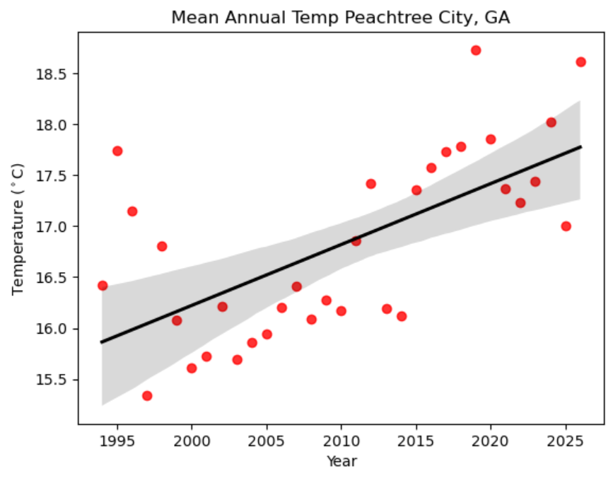

### Michael Pitts
Undergraduate at CU Boulder studying Geography w/ GIS emphasis, minor in Atmospheric and Oceanic Science. Currently working on GIS project for the community of Beulah Valley, Colorado to help recover after the Aspen Acres Fire. 

### Contact Information
* michael.pitts@colorado.edu
* [www.linkedin.com/in/michaelpitts21](www.linkedin.com/in/)

### Lake Peachtree
Map of Lake Peachtree located in Peachtree City, Georgia.

<embed type="text/html" src="img/lakeptc.html" width="600" height="600">

## Overview

This project examines long-term changes in annual average temperature in Peachtree City, Georgia. Historical climate observations from Atlanta Regional-Falcon Field Airport were used to calculate annual average temperature and identify if a long-term trend exists. Unfortunately, data at this site only goes back to 1994 but is the most reliable data source in Peachtree City. 

## Data and Methods

I used historical climate data from NOAA's National Centers for Environmental Information (NCEI) through the Climate Data Online (CDO) portal. Monthly average temperature observations were grouped by year to calculate annual average temperature. A linear regression was then used to estimate the long-term trend in annual temperature.

## Annual Temperature Trends

**Figure 1. Annual average temperature in Peachtree City, Georgia.**

The annual temperature record shows year-to-year variability, but the overall trend is an increase in annual temperature. 
The linear regression indicates a change of approximately 0.06 degrees Celsius per year over the period analyzed. 

## Context

This site is located in an area where there has been minimal change in immediate surroundings as it is located at an airport and is the station used for the regional NWS office. While the period of record is short for most stations, this consistency of the site shows this increase in temperature over the last three decades is meaningful. However, there is one factor I believe should be considered for this site. As displayed by the graph above, average yearly temperatures were almost always below 17 Celsius prior to the mid-2010s. Starting in the mid-2010s, average yearly temperatures have all been right around or above 17 Celsius. This is significant because Lake Mcintosh, a 650 acres reservoir, reached full pool in the summer of 2013. Lake McIntosh is located immediately adjacent to the airport to the northwest, which is significant in proximity and also the fact that prevailing winds in this region are from the west and northwest. Winds typically are strongest in the fall through spring, which may lead to moderating temperatures locally especially during the cooler months of the year. Regardless, this station would likely show an overall increasing trend in temperature, but it could also be influenced by local changes.

## Conclusion

Overall, the Peachtree City climate record shows an increase in temperature. However, this station may be biased post-mid-2010s due to changes in local geography with the introduction of Lake Mcintosh. A noticeable jump in temperature right after the reservoir filled gives reason to believe it may be influencing this site. I think it would be important to gather data from other stations in the area and compare to see if they had a similar jump in temperature around the same time in order to make a full conclusion about temperature trends in the area.

